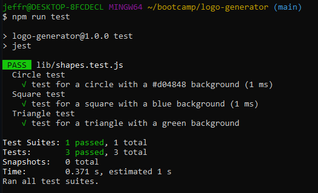

# Logo Generator

## Description

This project uses node.js to generate a logo based on the user's answers to inquirer prompts. It takes those answers and creates a 300x200 .svg file for the user.

## Table of Contents (Optional)

- [Installation](#installation)
- [Credits](#credits)
- [License](#license)
- [Tests](#tests)

## Installation

1: Clone the repo onto your local system

2: Open Git Bash or your Terminal and navigate to the directory where you cloned the repo.

3: enter 'npm i' to install the proper dependencies needed for this app.

4: enter 'node index.js' to run the app.

## Credits

Made in collaboration with UTSA coding boot camp staff

## License

Please refer to the license in the repo.

## Tests

[Video](https://drive.google.com/file/d/12UXOnoUDN59vhOU8uVIfxOKiY6sN7z47/view)